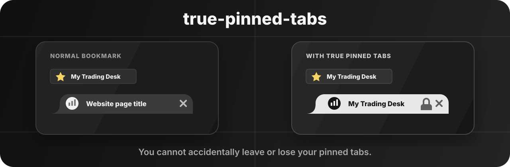

# true-pinned-tabs

Named, locked, bookmark-like tabs for Chrome.

## Features

- Custom titles for saved pages.
- Optional tab lock to prevent accidental navigation or switching.
- Locked tabs stay on their saved page, so they do not drift away or get lost.
- Bookmark-style popup with folders, drag and drop, and quick open.
- Query/hash changes and page reloads stay allowed.
- `Cmd+click`, `Ctrl+click`, middle click, and new tabs stay allowed.
- Local-only storage. No network requests.

## Install

1. Open `chrome://extensions`.
2. Enable `Developer mode`.
3. Click `Load unpacked`.
4. Select this repository folder.

## Permissions

- `storage` saves titles, folders, and settings locally.
- `tabs` focuses saved tabs and supports lock behavior.
- `<all_urls>` lets the extension work on pages you choose.

## Notes

Chrome does not expose native tab locking to extensions. This extension prevents common accidental navigation and switching, but it is not a browser-level lock.
